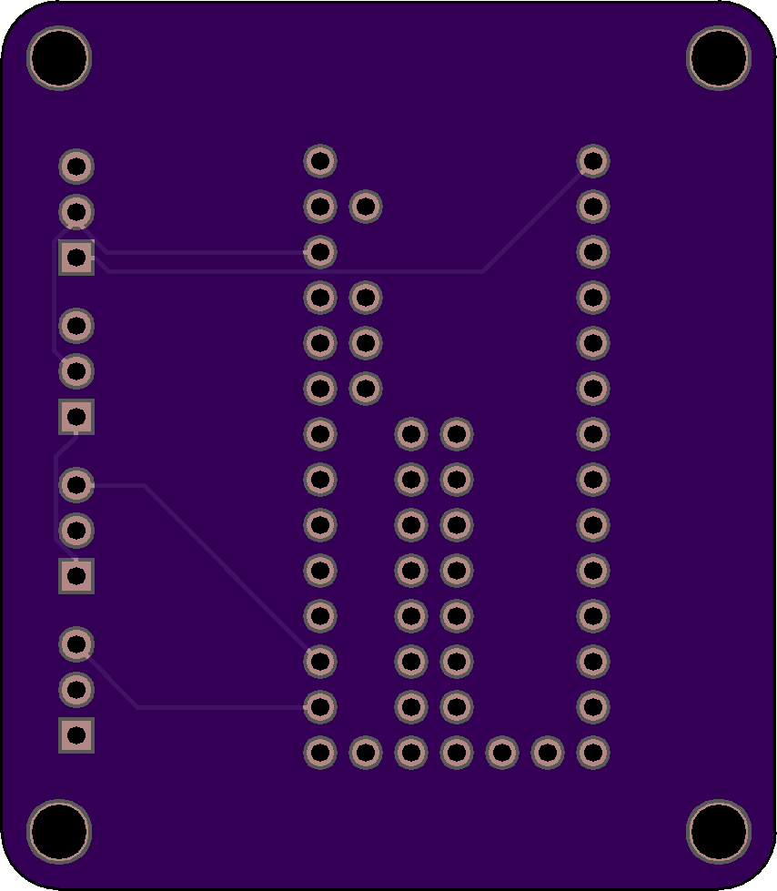

# teensy_to_em3242 
Shield for Teensy3.2 with headers for Connecting to the EM3242 angle sensor IC via the 
angle_sensor_em3242 breakout board. 

* [Schematic (PDF)](teensy_to_em3242.pdf)
* [Bill-of-materials](BOM.txt)

# Top View: 

# Bottom View:

# License: 
Creative Commons Attribution 4.0 International CC BY 4.0

